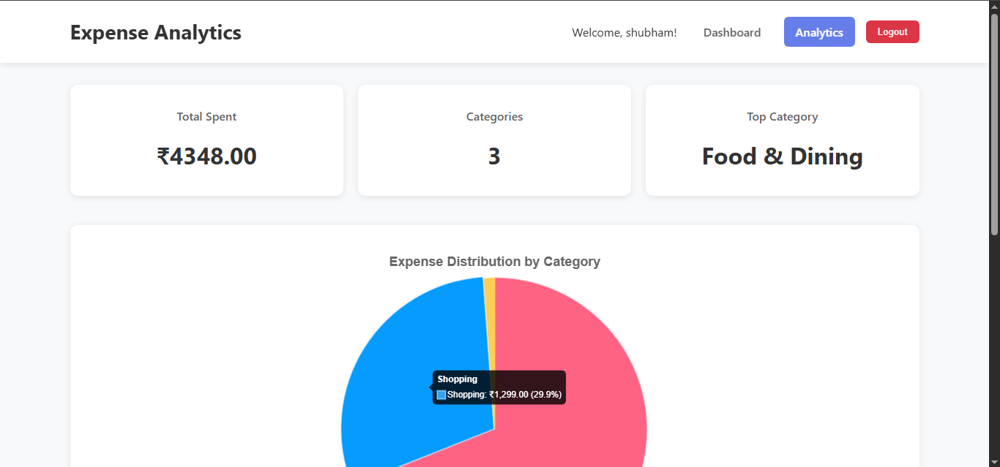
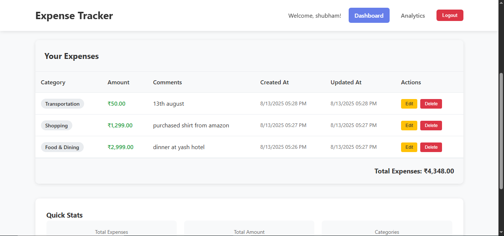

# Expense Management App


## Screenshots

### Analysis


### Dashboard


### Home Page


### Login Page


### Sign Up Page


Follow these steps to run the project locally.

### Backend Setup

1. **Install MySQL Server**  
   Make sure you have MySQL installed and running on your system.

2. **Navigate to the backend directory**  
   ```bash
   cd backend
   ```

3. **Install dependencies**  
   ```bash
   npm install
   ```

4. **Run the backend server**  
   ```bash
   npm run dev
   ```

---

### Frontend Setup

1. **Navigate to the frontend directory**  
   ```bash
   cd frontend
   ```

2. **Install dependencies**  
   ```bash
   npm install
   ```

3. **Run the frontend application**  
   ```bash
   npm start
   ```

Once both the backend and frontend are running, you can access the app in your browser.
